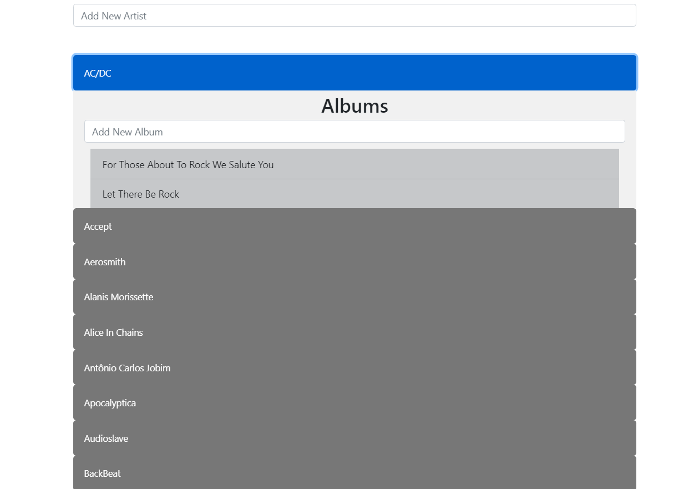

## Aufgabe: Eine einfache Musikdatenbank

Erstellen Sie auf Basis der Anwendung "Kursbuch Medieninformatik" aus der Vorlesung eine Webanwendung, in der die Künstler/Bands sowie deren Musikalben dargestellt werden. Erstellen Sie eine eigene Datenbank mit Ihren Lieblingskünstlern (mindestens 3) und dazugehörigen Alben (mindestens zwei pro Künstler) und halten Sie sich dabei an den Aufbau der Relationen "artists" und "albums" der  Datenbank Chinook aus SL4. Sie können auch gerne Künstler aus der Chinook Datenbank verwenden. Als Nutzer der Anwendung soll man in der Lage sein neue Künstler sowie Alben zu definieren, welche anschließend in Ihrer Liste angezeigt und in der Datenbank persistiert werden.

Die folgende Abbildung zeigt einen Ausschnitt aus dem User Interface:

{ height=12cm }

Fügen Sie der Anwendung einen Header hinzu und bauen Sie ebenfalls [\textcolor{blue}{Collapsibles}](https://www.w3schools.com/howto/howto_js_collapsible.asp) ein, um das Aufklappen der Liste zu realisieren und die Alben des entsprechenden Künstlers darzustellen. Nutzen Sie für die Gestaltung der zur Laufzeit gerenderten Elemente das [\textcolor{blue}{Template-Tag}](https://developer.mozilla.org/de/docs/Web/HTML/Element/template). Die Daten (Künstler und Alben) sollen automatisch beim Laden der Seite aus der Datenbank abgefragt und anschließend dargestellt werden.

Achten Sie auf eine aussagekräftige Variablenbenennung und auf die Auslagerung von Methoden.

*Abgabekriterien:*

Laden Sie Ihre Lösung bis spätestens 26.7.2020 (23:59 Uhr) als zip-komprimierten Ordner auf GRIPS hoch.  Benennen Sie die einzelnen Dateien pro Aufgabe sinnvoll und verwenden Sie geeignete Formate:

- Aufgabe: Ihr gesamtes Projekt

Der Name der Zip-Datei ergibt sich aus dem Präfix „SL_WT_SS20“, der Nr. der Studienleistung, ihrem Vor- und Nachnamen jeweils getrennt durch _ .

 

Beispiel: **SL_WT_SS20_5_Max_Mustermann.zip**

